<h1>Compte rendu du projet e_banking (Backend)</h1>
      <h1>Introduction</h1>

Le projet Digital Banking a pour objectif de développer une application de e-banking qui permet de digitaliser les processus bancaires, la création de comptes et la gestion des différentes opérations bancaires.

<h2>Architecture du projet</h2>
<ul>
<li>
Backend : Construit en utilisant le framework Spring, basé sur l'architecture JEE, avec une sécurité assurée par Spring Security.
Frontend : Développé avec Angular pour fournir une interface utilisateur interactive et réactive.
</li>
</ul>
<h1>Fonctionnalités du Backend</h1>
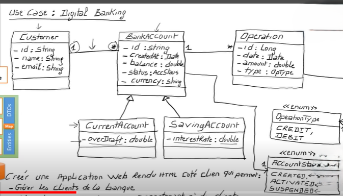
<h1>Approche "Single Table"</h1>

Pour modéliser l'héritage dans la base de données relationnelle, nous avons utilisé l'approche "Single Table". Cette approche consiste à créer une table unique qui contient les attributs de la classe abstraite ainsi que ceux des classes dérivées. Un attribut supplémentaire "type" est utilisé pour distinguer les comptes courants des comptes épargnes.

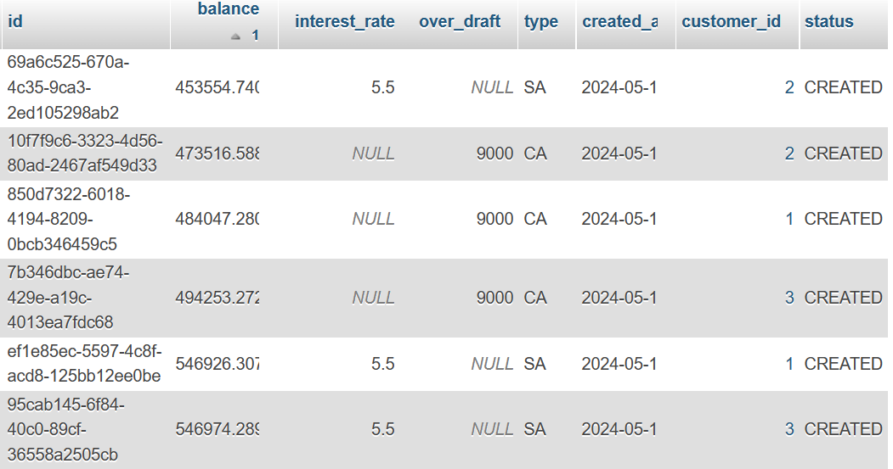
<h2>Gestion des opérations bancaires</h2>

Chaque compte bancaire peut effectuer des opérations de débit et de crédit, qui sont enregistrées et gérées par le système.

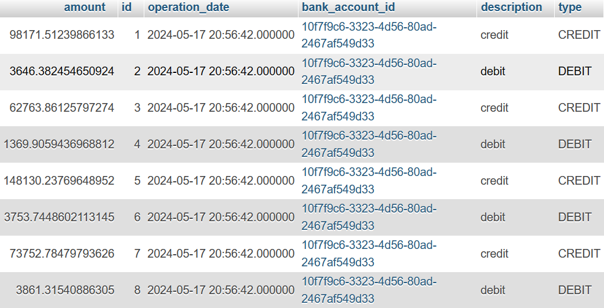
<h5>Contrôleurs</h5>

Pour les actions, j'ai créé deux contrôleurs :

<ul>
<li>
CustomerController :
Gère les actions liées aux clients, telles que l'ajout, la mise à jour, et la récupération des informations des clients.
BankAccountController :
Gère les actions liées aux comptes bancaires, telles que la création de comptes, la récupération des détails des comptes et la gestion des opérations bancaires.
</li>
</ul>
<h1>Tests des actions</h1>

Pour tester les différentes fonctionnalités, nous avons utilisé l'outil Postman :

<h1>Actions liées aux clients (CustomerController)</h1>
<ul>
<li>
Liste des customers:Récupération de tous les clients.
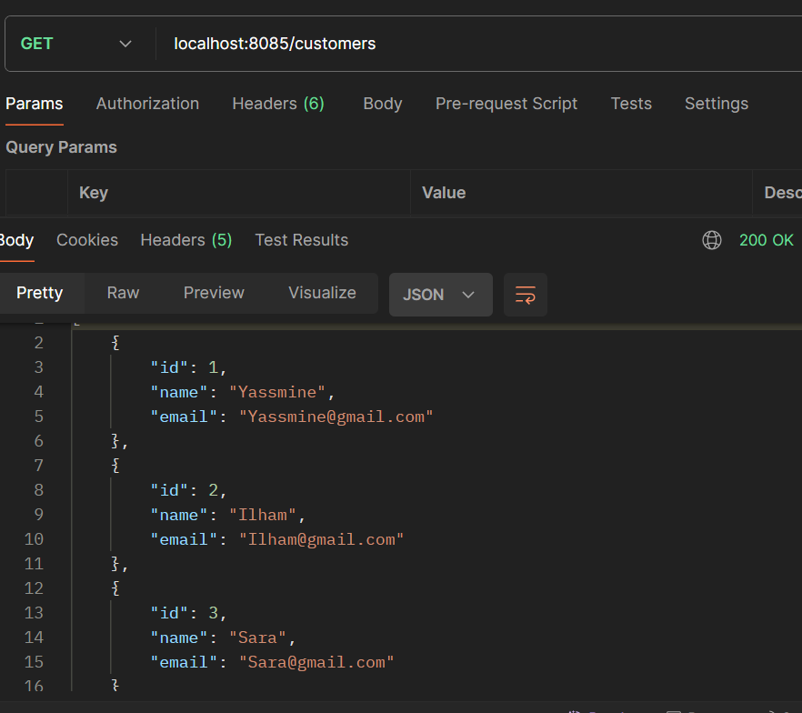
Get customer  : Récupération des détails d'un client spécifique.
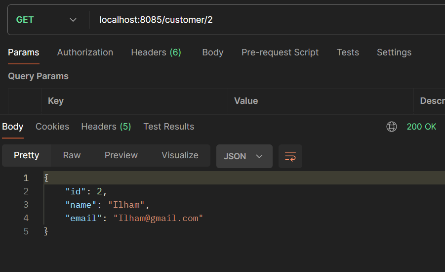
Add customer : Ajout d'un nouveau client.

Update customer: Mise à jour des informations d'un client existant.
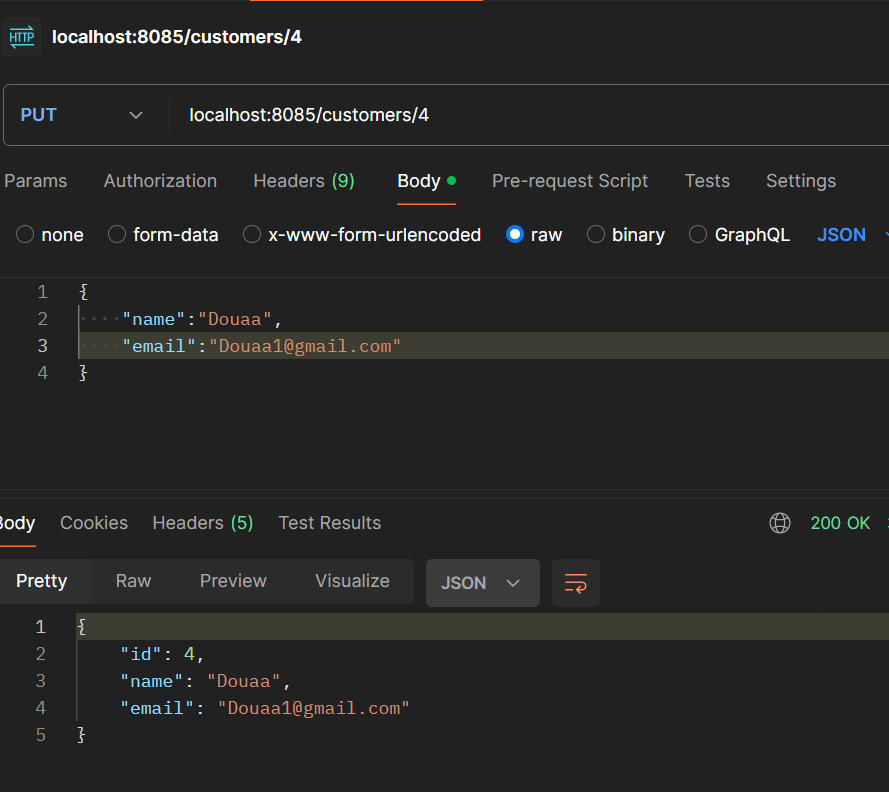
</li>
</ul>
<h2>Actions liées aux comptes bancaires (BankAccountController)</h2>
<ul>
<li>
Liste des comptes : Récupération de tous les comptes bancaires.
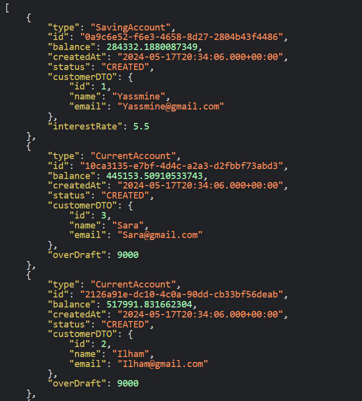
Get compte : Récupération des détails d'un compte spécifique.
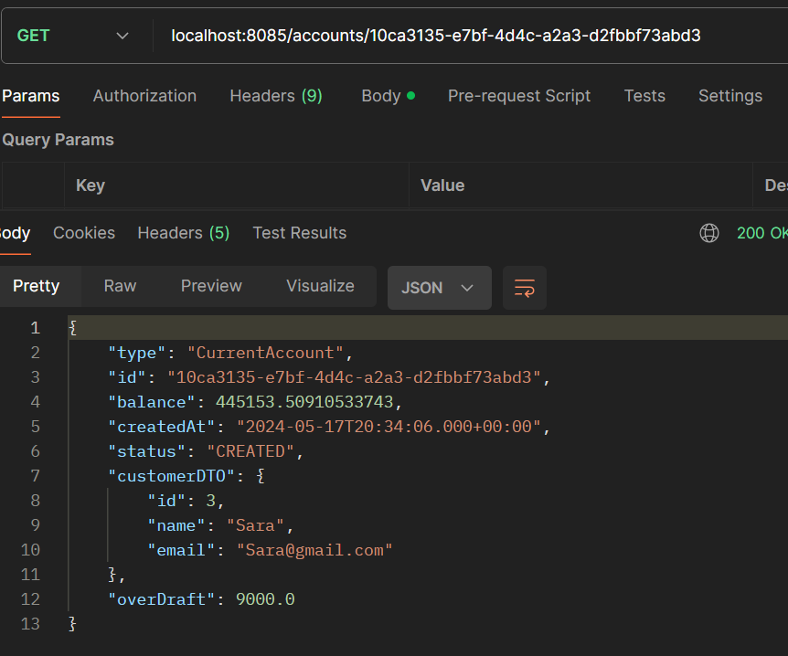
Get historique du compte : Récupération de l'historique des opérations d'un compte.
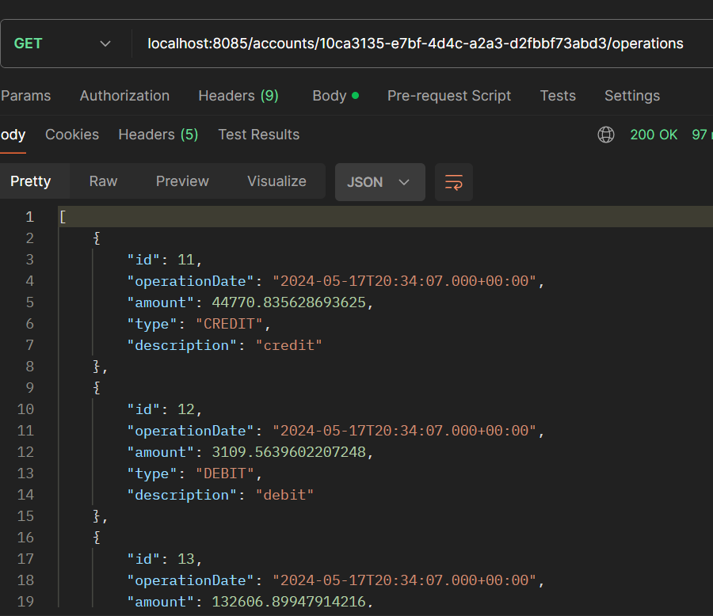
Get historique du compte avec pagination : Récupération de l'historique des opérations d'un compte avec pagination.
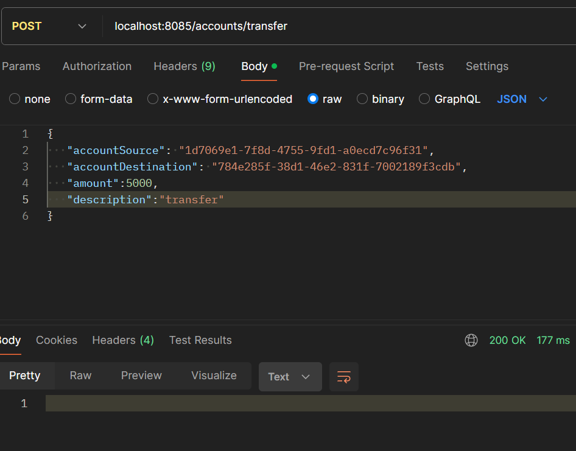
Opération de transfert : Réalisation d'une opération de transfert entre deux comptes.
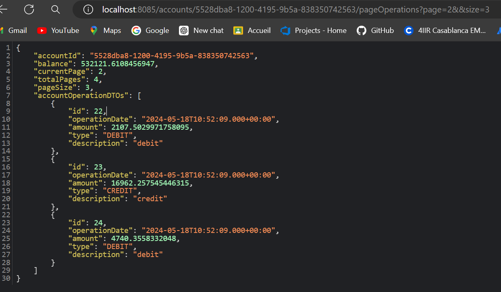
</li>
</ul>
<h1>Sécurité avec Spring Security</h1>

Pour sécuriser l'application, nous avons mis en place les éléments suivants :

<ul>
<li>
<h2>Configuration de la sécurité</h2>
Gestion des utilisateurs : Les utilisateurs sont gérés en mémoire avec un encodage sécurisé des mots de passe.
Filtres de sécurité : Implémentation de filtres pour les requêtes HTTP, incluant la configuration des serveurs de ressources OAuth2 pour JWT.
CORS : Configuration pour permettre les requêtes provenant de toutes les origines.
Gestion de l'authentification : Utilisation d'un gestionnaire basé sur les détails des utilisateurs et d'un encodeur de mots de passe.
<h2>Contrôleur de sécurité</h2>
Récupération des détails de l'utilisateur authentifié : Endpoint /auth/profile.
Authentification et génération de token JWT : Endpoint /auth/login, utilisant AuthenticationManager pour l'authentification et JwtEncoder pour la création des tokens JWT contenant les informations de l'utilisateur, comme le nom d'utilisateur et les rôles.
</li>
</ul>
<h1>Conclusion</h1>

Ce projet démontre une approche complète pour la digitalisation des services bancaires, en utilisant des technologies modernes pour assurer la sécurité, l'efficacité et la convivialité du système.

